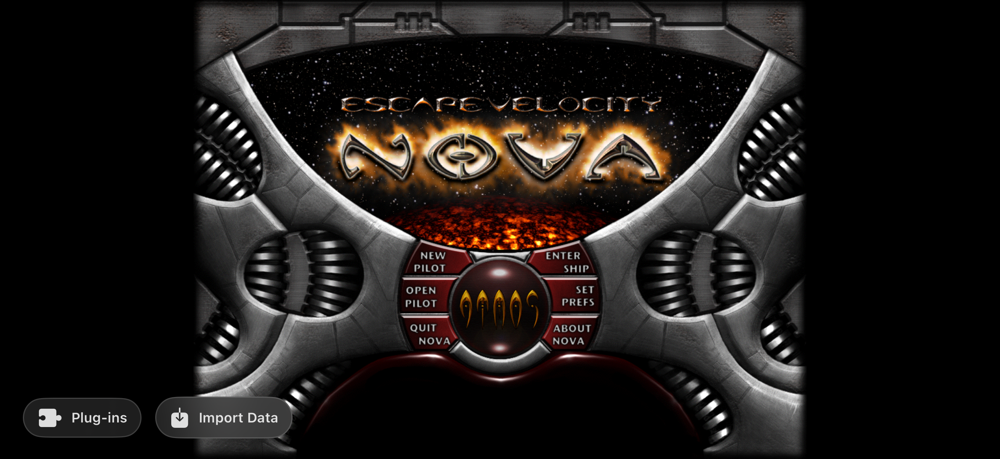

# NovaSwift


A native Swift/Metal port of **EV Nova**, rebuilt from scratch so it runs
properly on a modern Mac, iPad, or iPhone. Unofficial and unaffiliated with
the original publisher — see [Legal](#legal).

## What this is

EV Nova (Ambrosia Software / ATMOS, 2002) is a 2D space trading, combat, and
mission game with one of the deepest campaigns and plug-in ecosystems ever
built for a niche Mac title. The original binary is PowerPC/Carbon-era code:
it doesn't run natively on Apple Silicon, has no iOS build, and the one
serious open-source revival (Kestrel, C++) is desktop-only and dormant since
2023.

So this project reimplements the whole thing — resource-file parser, flight
and combat sim, AI, mission/story engine, economy, UI — from the ground up
in Swift, targeting Metal/SpriteKit so it runs natively on iOS, iPadOS, and
macOS. Not a wrapper, not an emulator: it reads the *original game's data
files* and reproduces the original as faithfully as possible.

## Why this project exists

**Mainly: get the real game onto iPhone and iPad.** EV Nova has never had a
mobile release, and the original app won't run on anything Apple ships
today. A native Swift/Metal rewrite gets the actual game — same ships, same
missions, same economy — running with touch controls in your pocket.

**Secondarily: once it's code we control, we can go further than 2002
allowed.** The original engine is a fixed, closed target. A native rewrite
can add better-than-original AI, higher-resolution art, richer audio,
controller support — all as **opt-in layers on a faithful base**, never a
replacement for it. See [docs/MODERNIZATION.md](docs/MODERNIZATION.md) for
the concrete plan; none of it has shipped yet, but the seams already exist.

Fidelity always comes first: a pure "Classic" run must stay reproducible and
behave exactly like the original. Enhancements are additive, never a
substitute.

**The rule that shapes everything else:** we ship code, you bring the game.
EV Nova's data is still owned by ATMOS — this repo contains zero copyrighted
game content, and never will. `NovaSwiftKit` reads your own legally-owned
copy at runtime (classic resource forks, `.ndat`, or the modern `BRGR .rez`
container), the same bring-your-own-data model as OpenMW or OpenRA. Full
reasoning in **[docs/CHARTER.md](docs/CHARTER.md)** — read that first, it
governs every other decision in this repo.

## How AI fits into this project

**This codebase is built with heavy AI assistance.** Most of the engine,
UI, and reverse-engineering work has been developed collaboratively with
Claude Code — reconstructing resource-file layouts from a decompiled
original, writing and testing the Swift engine, building the SwiftUI/
SpriteKit app. Every change is still checked against the real game's
behavior; fidelity-first applies regardless of who (or what) wrote the code.

**Separately, AI is also a subject *inside* the game.** NPC ships run on a
real behavior engine (`AIBrain.swift`) reconstructed from the original's own
decision tables — combat odds, flee/press thresholds, target selection,
formation and fleet behavior all come from real `düde`/`flët` data, not
hardcoded scripts. See [docs/AI.md](docs/AI.md) and
[docs/AI_GROUND_TRUTH.md](docs/AI_GROUND_TRUTH.md). An opt-in "Enhanced AI"
mode is planned (smarter evasion, coordinated fleets, ammo conservation),
off by default, layered behind the same `AIBrain.think` seam.

## Screenshots

Mobile build running on iPhone 17 Pro (iOS):

| Main menu | Flight | Galaxy map |
|---|---|---|
|  |  |  |

## Status — what actually works right now

This is a real, playable game now, not a tech demo. On your own game data you
can today:

- Fly with the original Newtonian flight model, fight AI ships spawned from
  the real fleet tables, and get hit with real ionization, combat-odds AI
  decision-making, and target-lock.
- Navigate the real galaxy map, plot a course, and jump between systems —
  jumps cost real fuel, gated by the ship's actual tank.
- Land, and trade / outfit / buy ships in the spaceport against a persistent
  pilot save — with mission-gated item availability, mass-proportional outfit
  pricing, gun/turret slot limits, and **paid repairs and fuel recharge** (no
  more free heal on landing).
- Take and **complete** missions from the bar and Mission Computer — the
  galaxy-day clock advances as you play, so `crön` background events (news,
  dated story beats) fire, mission ships spawn and fight, and delivery/courier
  missions pay out and progress the campaign.
- **Actually lose**: run your armor to zero and you eject in an escape pod
  (rescued at the nearest port) or the game ends back at the main menu.
- Dent your standing with governments in combat, meet `përs` named captains
  with their own hail quotes and grudges, and open the in-game **Story Map** —
  a pannable/zoomable graph of every reconstructed campaign, resolved live
  against your pilot (something the original never had).
- Browse and install community plug-ins from an in-app store.
- Pop open an in-game **debug suite** (AI state/path visualization, a
  live game-state editor, a performance stress test) while developing.

The biggest remaining gap is **fidelity, not features**: EV Nova's AI and
ship-spawning logic were never open-sourced, so ours is reconstructed from the
game's data and observed behavior. It covers the documented behavior well, but
spawn cadence, flight smoothness, and some combat transitions don't yet *feel*
exactly like the original — that naturalness is the top backlog item. A few
built-and-tested systems are also still awaiting their final UI hookup (Demand
Tribute / planetary domination, escort hiring, junk trading).

See **[docs/STATUS.md](docs/STATUS.md)** for the full wired-vs-built-vs-
missing breakdown — that document, not this README, is the source of truth.

```bash
swift build && swift test                    # build the core + run tests
scripts/fetch-plugins.sh                     # grab free community plug-ins (test data)
# With your own EV Nova data in data/base/:
.build/debug/novaswift-extract types   "data/base/Nova Files/Nova Data 1.rez"
.build/debug/novaswift-extract sprites "data/base/Nova Files/Nova Ships 1.rez" out/
```

## Goals

See the **[Charter](docs/CHARTER.md)** for the full statement. In short:

- **Fidelity first** — match the original's flight, combat, economy,
  missions, AI, and UI, reconstructed from the real data. Modern additions
  (resolution, touch, controllers, AI tuning, QoL) are opt-in and additive.
- **Bring your own data** — nothing copyrighted is bundled; everything at
  runtime is decoded from the player's own files.
- **Native Apple app** — Metal-backed, touch-first on iPhone/iPad, keyboard/
  mouse + controller on macOS. Runs the base game and arbitrary plug-ins /
  total conversions.

## Repository layout

```
docs/                   Charter, status, architecture, data-format reference, roadmap
Sources/
  NovaSwiftKit/            Data layer — resource parsing, typed decoders, sprite/PICT decode
  NovaSwiftEngine/         Live simulation — flight, combat, AI, spawning, diplomacy
  NovaSwiftStory/          Mission/story runtime — mïsn/crön/NCB engine (wired into the app)
  NovaSwiftPluginStore/    Plug-in catalog metadata + download/install pipeline
  novaswift-extract/       CLI inspector/harness (drives the libraries end-to-end)
Tests/                  Unit tests for each library target
app/NovaSwift/             The multiplatform SwiftUI/SpriteKit app (the game itself)
  App/ Game/ Spaceport/ Pilots/ Story/ Store/ Launcher/ Input/ Audio/ UI/ Debug/ Data/
app/NovaSwift.xcodeproj
assets/                 This project's own art (icon, placeholders) — no game data
scripts/                Setup / fetch / build helpers
data/base/              ⬅ YOU place your legally-owned EV Nova data here (git-ignored)
data/plugins/           Community plug-ins & total conversions (git-ignored)
data/converted/         Extractor output (git-ignored)
third_party/            Vendored open-source deps (fetched by scripts, not committed)
```

(`engine/` and `tools/` are legacy empty placeholders from an earlier layout
and will be removed; the real code is the Swift package above.)

## Getting started

> Requires macOS with Xcode command-line tools.

```bash
scripts/setup.sh          # fetch open-source dependencies into third_party/
# Place your EV Nova data files into data/base/  (see docs/GET_THE_DATA.md)
scripts/fetch-plugins.sh  # (optional) download freely-distributable community plug-ins
swift build && swift test
```

Detailed data steps live in [docs/GET_THE_DATA.md](docs/GET_THE_DATA.md). Open
`app/NovaSwift.xcodeproj` in Xcode to build and run the app.

## Documentation

- **[docs/CHARTER.md](docs/CHARTER.md)** — the authoritative goal (read first).
- **[docs/STATUS.md](docs/STATUS.md)** — verified wired-vs-built-vs-missing map.
- **[docs/ROADMAP.md](docs/ROADMAP.md)** — sequenced plan, wiring-first.
- **[docs/ARCHITECTURE.md](docs/ARCHITECTURE.md)** — engine decision & layers.
- **[docs/MODERNIZATION.md](docs/MODERNIZATION.md)** — the opt-in enhancement
  layer: smarter AI, HD art/audio packs, everything beyond the original.
- **[docs/DATA_FORMAT.md](docs/DATA_FORMAT.md)** — resource formats & type codes.
- Subsystem deep-dives: [AI](docs/AI.md), [ship system](docs/SHIP_SYSTEM.md),
  [missions & story](docs/MISSIONS.md),
  [mobile & plug-ins](docs/MOBILE_AND_PLUGINS.md),
  [editor scope](docs/EDITOR_AND_PLUGINS_SCOPE.md).

## Legal

EV Nova and its game data are **copyrighted**. This project does **not** and
**will not** redistribute the base game's data files. To use this port you
must supply your own legally-obtained copy of EV Nova.

- **Base game data** → you must own EV Nova; the repo helps you *extract*
  from your own copy. It is never bundled here.
- **Community plug-ins / total conversions** → freely distributed by their
  authors; the fetch script and in-app store only pull ones offered for free
  download, and their own licenses/readmes apply.
- **This project's code** → open source (see [LICENSE](LICENSE)).

This is an interoperability / preservation effort in the spirit of engine
reimplementations like OpenRA, OpenTTD, and devilutionX. It is unaffiliated
with and unendorsed by Ambrosia Software, ATMOS, or the original authors.
