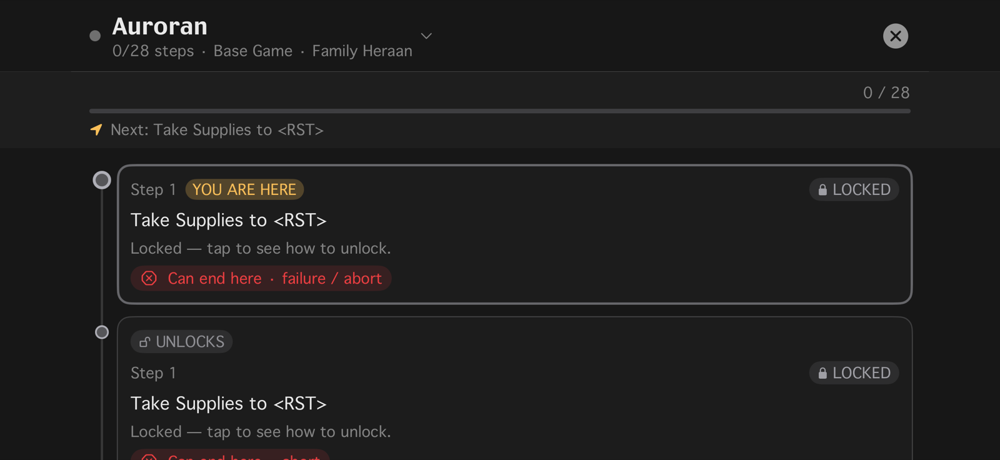
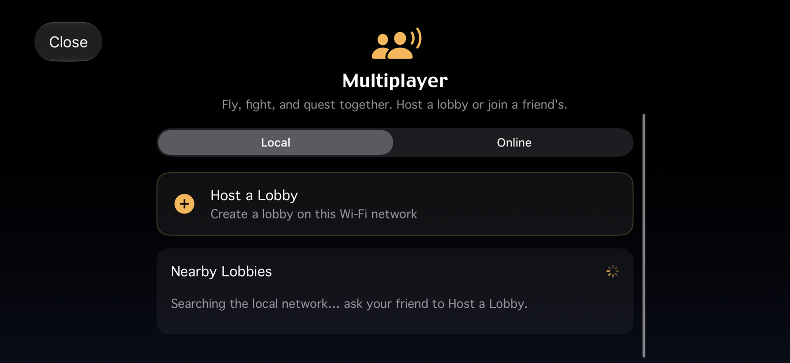
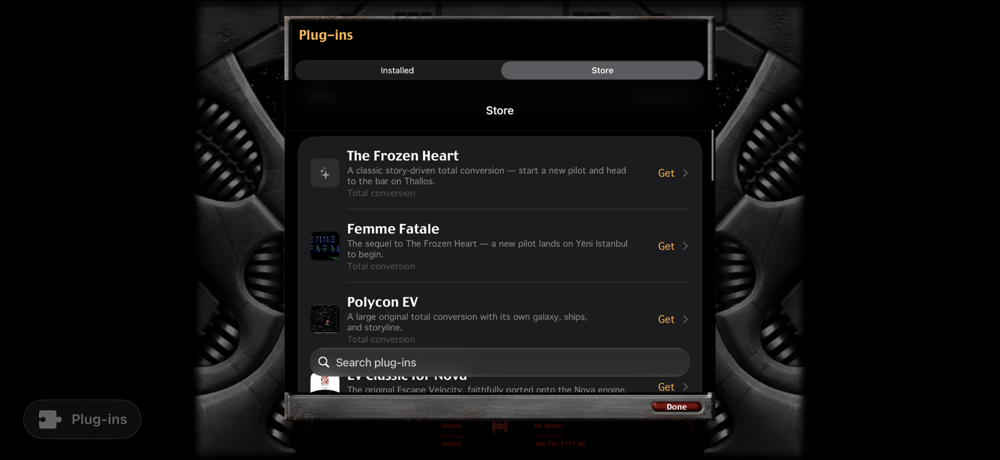

# NOVA Swift


**A fan rebuild of EV Nova, the 2002 space classic — written from scratch in
Swift so it runs natively on your Mac, iPad, and iPhone.** Unofficial,
unaffiliated, and bring-your-own-data. See [Legal](#legal).

---

EV Nova (Ambrosia Software / ATMOS, 2002) is one of the deepest space
trading-and-combat games ever made. You start in a beat-up shuttle, haul cargo,
take on missions, pick a side in a slow-burning war, and work your way up to a
ship that can level a planet. The catch: the original is PowerPC/Carbon code. It
won't launch on a modern Mac, it never came to phones or tablets, and the one
serious open-source revival went quiet in 2023.

**NOVA Swift** rebuilds the whole thing from scratch in Swift — the resource
parser, flight and combat, AI, missions, economy, and UI. It's not a wrapper and
not an emulator. You point it at a copy of EV Nova you already own, and it reads
your data and plays the game natively, with touch controls built for a screen you
hold.

It runs today on **macOS, iPadOS, iOS, and tvOS**, all tested on real devices.
A native **Godot port for Linux and Windows** is also underway — see
[Beyond Apple](#beyond-apple-the-godot-port).

## Screenshots

Running on iPhone (iOS):

| Flight | Galaxy map |
|---|---|
|  |  |
| Touch controls, the classic status bar, and Earth waiting to be landed on. | Plot a course from Sol — services, governments, hypergates and wormholes. |

| Story map | Multiplayer |
|---|---|
|  |  |
| Every campaign in your data, drawn against how far your pilot has actually gotten. | Host or join a co-op lobby over local Wi-Fi or Game Center. |

| Plug-in store |
|---|
|  |
| Browse and install community plug-ins and total conversions without leaving the game. |

## What you can do today

It's the year 1177. The Federation holds the core worlds and is rotting from the
inside, the Auroran Empire is tearing itself apart over honor, the Polaris won't
say what they know, and you're in a Shuttle with a few thousand credits and no
particular plans. This is all of EV Nova — point it at your own copy of the game
data and go. The clock keeps ticking whether you're paying attention or not, so
the galaxy carries on without you.

- **Fly and fight** — the drifting, momentum-heavy flight the original was built
  on: you don't turn, you swing the nose around and keep going the way you were.
  Pirates jump in on top of you, bounty hunters come looking, and warships weigh
  the odds before they commit. Lock a target, strip its shields, watch the ion
  cannons leave it drifting.
- **Explore and trade** — hyperjump between hundreds of systems on real fuel,
  land, and work the spread: buy food where it's cheap and sell it where the war
  made it dear. Then spend it all in the shipyard, trading the Shuttle up through
  a Starbridge to something with real guns bolted on.
- **Play the story** — pick a starting scenario, take the missions people offer
  you, and see them through. Fly for the Federation or defect to the Rebellion,
  get pulled into the Auroran succession, find out what the Vell-os are. The
  campaigns branch and the news reacts as the days pass. Your pilot saves and
  backs up as you go, and you can keep several running at once.
- **Fight dirty, and lose for real** — disable a freighter and board it to take
  its cargo, or put a prize crew aboard and fly the hull home. Park over a planet,
  demand tribute, beat its defenses, and it pays you every day thereafter. Shoot
  the wrong ship in the wrong system and the government remembers — and when your
  own armor hits zero, you punch out in an escape pod, if you bought one.
- **Meet the locals** — named captains with their own lines and history turn up in
  the shipping lanes, escorts you hire draw a daily wage whether they're useful or
  not, and there's always somewhere to throw credits away on the holovid races.
- **Play together** — the one thing the 2002 original never had. Host or join a
  co-op session over local Wi-Fi or Game Center: your friend keeps their own
  galaxy and their own pilot, but when you're both in the same system you fly it
  together — same NPCs, same fight, real damage. Trade cargo and credits, chat
  from anywhere in the galaxy, and set the PvP stakes yourself, from safe sparring
  to real damage and real death. See [docs/MULTIPLAYER.md](docs/MULTIPLAYER.md).

## Modern touches — classic at heart

We've layered a lot of quality-of-life on top of the game. The rule we hold to:
**anything that wasn't in the 2002 original can be switched off.** Play it pure
and it behaves like the game you remember; flip the modern bits on when you want
them.

- **Touch controls that feel right** — real iPhone and iPad builds designed for a
  handheld screen, not a desktop UI squeezed onto glass. Keyboard and mouse still
  work great on the Mac.
- **A live Story Map** — a pannable, zoomable map of every campaign in your data,
  drawn against how far your pilot has actually gotten.
- **An in-app plug-in store** — browse and install community plug-ins and total
  conversions without leaving the game. Still a work in progress, but most of it
  already works.
- **Classic / Enhanced toggles** — presentation and behavior switches let you keep
  everything original, or opt into the modern layer piece by piece.
- **A built-in debug suite** — AI state and path visualization, a live game-state
  editor, and a performance stress test.

## Where it's at — honestly

**NOVA Swift is a near-complete, faithful port of EV Nova — you can play the
whole game today, start to finish, on macOS, iPadOS, iOS, and tvOS.** Flight and
combat, the economy, the missions and their branching campaigns, boarding and
capture, planetary domination, named captains, hired escorts, real explosion
sprites and particle effects — the systems that make EV Nova *EV Nova* are all in
and playable. Call it a ~90%-complete full port.

What's left is the last stretch that turns "complete" into "hard to tell apart
from the original":

- **Polish & fidelity** — fine-tuning the AI, flight feel, spawn cadence, and the
  hundred small behaviors so a pure *Classic* run feels exactly like 2002.
- **Bugs, crashes & performance** — the usual hardening as more people play on
  more devices.
- **Enhancements & new features** — things the 2002 original never had.
  Multiplayer, full controller support, a tvOS build, and iCloud syncing for
  your imported game data are all built and playable today (see above and
  below); optional HD art is still ahead (see [What's coming](#whats-coming)).

If you find something off, the
[issue tracker](https://github.com/SirStig/MacOS-iOS-iPadOS-EV-Nova/issues) is
the best place to tell us.

## What's coming

Fidelity comes first: a pure **Classic** run stays reproducible and behaves like
the original. Everything modern is an opt-in layer on top, never a replacement.

- **Multiplayer** — **the core system is built and working**, not just planned:
  host-authoritative shared-system combat, presence on the galaxy map, chat,
  trading, PvP stakes, lobbies with kick/ban, and both local Wi-Fi (Multipeer) and
  internet (Game Center) transports are implemented, wired into the app, and
  covered by tests. What's left is polish — wider multi-device testing, a couple
  of finer PvP toggles, and smoother authority handoff when a host disconnects
  mid-session. Full design and implementation status in
  [docs/MULTIPLAYER.md](docs/MULTIPLAYER.md).
- **Game controller support** — **built and wired**: full gamepad play with
  twin-stick flight and fully remappable buttons, on macOS, iPad, iPhone, and
  Apple TV (any MFi / Xbox / PlayStation controller). Full detail in
  [docs/CONTROLS.md](docs/CONTROLS.md).
- **Apple TV** — **live**, not just planned: a tvOS build with its own 10-foot
  UI, controller-required by design (the Siri Remote can't fly a ship), plus
  two ways to get your game data onto it with no Files app in sight — iCloud
  auto-restore or a local web-browser importer. Full detail in
  [docs/TVOS.md](docs/TVOS.md).
- **iCloud syncing for game data** — **built and wired**: import your EV Nova
  data once, and NOVA Swift can sync it through your own private iCloud so
  every other device you own — including a freshly-set-up Apple TV — restores
  it automatically instead of re-importing. Full detail in
  [docs/ICLOUD_SYNC.md](docs/ICLOUD_SYNC.md).
- **Smarter, opt-in AI** — better evasion, coordinated fleets, and ammo discipline,
  behind the same brain the base AI uses, so you can leave it Classic or turn it up.
- **HD art & richer audio** — optional higher-resolution sprites and sound packs,
  layered over the originals rather than replacing them.

The plans live in **[docs/MODERNIZATION.md](docs/MODERNIZATION.md)** and
**[docs/ROADMAP.md](docs/ROADMAP.md)**.

## Beyond Apple: the Godot port

NOVA Swift's simulation, data layer, and story runtime are plain, portable
Swift with almost no Apple-framework coupling — only the app's UI and
rendering are SwiftUI/SpriteKit. That means a second frontend on **Godot 4**,
bridged to the same Swift engine through a
[SwiftGodot](https://github.com/migueldeicaza/SwiftGodot) GDExtension, can
bring NOVA Swift to **Linux and Windows** without forking or reimplementing
any of the game logic — the Apple app and the Godot build run the exact same
`World.step`.

This is in progress, not finished: a real Godot project (`godot/`) already
flies a ship with the engine's actual Newtonian flight, renders real ships
and planets decoded straight from the player's own data, and has a working
HUD, radar, target lock, and weapons readout. Landing and launch are wired;
the galaxy map, spaceport screens, and the story/mission runtime are next.
Full status, architecture, and milestone tracking in
**[docs/GODOT_LAYER.md](docs/GODOT_LAYER.md)**.

## Beta / TestFlight

Native builds for **macOS, iPad, and iPhone** are live on **TestFlight** — no
build step required. Join the public beta here:

**→ [testflight.apple.com/join/3FBzwwq1](https://testflight.apple.com/join/3FBzwwq1)**

The same link works for macOS and iOS/iPadOS. You'll still need to supply your own
legally-owned EV Nova data (see [The one rule](#the-one-rule-you-bring-the-game)).

## The one rule: you bring the game

We ship the code; you supply the data. EV Nova's content is still owned by ATMOS,
so **this repo contains zero copyrighted game data and never will.** `NovaSwiftKit`
reads your own legally-owned copy at runtime — classic resource forks, `.ndat`, or
the modern `BRGR .rez` container — the same bring-your-own-data model as OpenMW and
OpenRA. The full reasoning is in **[docs/CHARTER.md](docs/CHARTER.md)**, which
governs every decision in the repo.

## Built with AI

NOVA Swift is developed with heavy AI assistance — most of the engine, the UI, and
the reverse-engineering of EV Nova's resource formats were built collaboratively
with Claude Code. Every change is still checked against the real game's behavior;
fidelity-first applies no matter who (or what) wrote the line.

Fittingly, AI is also a subject *inside* the game: NPCs run on a real behavior
engine reconstructed from EV Nova's own `düde`/`flët` decision tables, not
hardcoded scripts. See [docs/AI.md](docs/AI.md).

## Building it yourself

> Requires a Mac with Xcode and its command-line tools installed. Your EV Nova
> data stays on your machine — it's git-ignored and never uploaded anywhere.

```bash
# 1 · clone
git clone https://github.com/SirStig/MacOS-iOS-iPadOS-EV-Nova.git
cd MacOS-iOS-iPadOS-EV-Nova

# 2 · fetch open-source dependencies
scripts/setup.sh

# 3 · add your EV Nova data into data/base/  (see docs/GET_THE_DATA.md)

# 4 · (optional) free community plug-ins
scripts/fetch-plugins.sh

# 5 · quick check from the command line
swift build && swift test

# …then open the app in Xcode to play:
open app/NovaSwift.xcodeproj
```

Pick a Mac, iPad, or iPhone target in Xcode and hit Run. Data steps are in
[docs/GET_THE_DATA.md](docs/GET_THE_DATA.md).

## Repository layout

```
docs/                  Charter, roadmap, architecture, data-format reference
Sources/
  NovaSwiftKit/          Data layer — resource parsing, typed decoders, sprite/PICT decode
  NovaSwiftEngine/       Live sim — flight, combat, AI, spawning, diplomacy
  NovaSwiftStory/        Mission/story runtime — mïsn/crön/NCB engine
  NovaSwiftPluginStore/  Plug-in catalog + download/install pipeline
  novaswift-extract/     CLI inspector/harness that drives the libraries end-to-end
Tests/                 Unit tests per library
app/NovaSwift/           The multiplatform SwiftUI/SpriteKit app (the game itself)
godot/                 Godot 4 frontend + SwiftGodot bridge (Linux/Windows port, in progress)
data/base/             ⬅ your legally-owned EV Nova data goes here (git-ignored)
```

## Documentation

- **[Charter](docs/CHARTER.md)** — the authoritative goal (read first).
- **[Roadmap](docs/ROADMAP.md)** — what's next, in order.
- **[Modernization](docs/MODERNIZATION.md)** — the opt-in enhancement layer.
- **[Architecture](docs/ARCHITECTURE.md)** · **[Data format](docs/DATA_FORMAT.md)** — how it's built.
- Deep dives: [AI](docs/AI.md), [ship system](docs/SHIP_SYSTEM.md),
  [missions & story](docs/MISSIONS.md),
  [mobile & plug-ins](docs/MOBILE_AND_PLUGINS.md),
  [controller support](docs/CONTROLS.md), [tvOS](docs/TVOS.md),
  [iCloud game-data sync](docs/ICLOUD_SYNC.md),
  [the Godot port](docs/GODOT_LAYER.md).

> Some of the deeper docs (e.g. status write-ups) lag behind the code — this
> README and the roadmap are the best current picture.

## Legal

EV Nova and its data are **copyrighted**, and this project never redistributes
them — you supply your own legally-obtained copy.

- **Base game data** → you must own EV Nova; the tools only extract from *your*
  copy. It is never bundled here.
- **Community plug-ins** → freely distributed by their authors; the fetch script
  and in-app store pull only free downloads, under their own licenses.
- **This project's code** → open source (see [LICENSE](LICENSE)).

A fan interoperability / preservation effort in the spirit of OpenRA, OpenTTD, and
devilutionX. Unaffiliated with and unendorsed by Ambrosia Software, ATMOS, or the
original authors.
