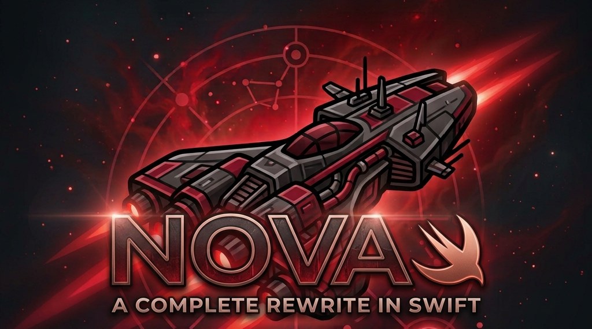
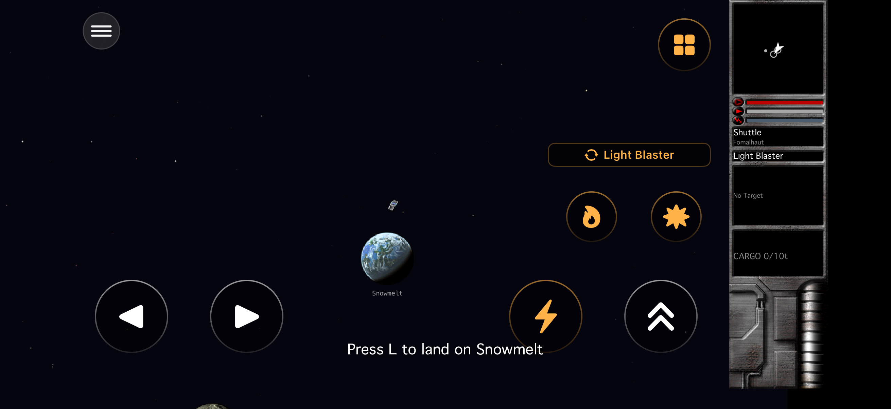
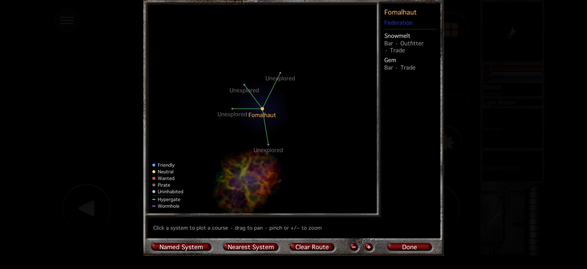

# NOVA Swift



**A fan rebuild of EV Nova, the 2002 space classic — written from scratch in
Swift so it runs natively on your Mac, iPad, and iPhone.** Unofficial,
unaffiliated, and bring-your-own-data. See [Legal](#legal).

---

EV Nova (Ambrosia Software / ATMOS, 2002) is one of the deepest space
trading-and-combat games ever made. You start in a beat-up shuttle, haul cargo,
take on missions, pick a side in a slow-burning war, and work your way up to a
ship that can level a planet. The catch: the original is PowerPC/Carbon code. It
won't launch on a modern Mac, it never came to phones or tablets, and the one
serious open-source revival went quiet in 2023.

**NOVA Swift** rebuilds the whole thing from scratch in Swift — the resource
parser, flight and combat, AI, missions, economy, and UI. It's not a wrapper and
not an emulator. You point it at a copy of EV Nova you already own, and it reads
your data and plays the game natively, with touch controls built for a screen you
hold.

It runs today on **macOS, iPadOS, and iOS**, all tested on real devices.

## Screenshots

Running on iPhone (iOS):

| Flight | Galaxy map |
|---|---|
|  |  |

## What you can do today

Point it at your own data and jump in. The in-game clock keeps ticking whether
you're paying attention or not, so the galaxy carries on around you.

- **Fly and fight** — the original drifting, momentum-based flight; enemies that
  spawn from the real fleet tables; target locks, ion damage, and ships that
  weigh their odds before committing.
- **Explore and trade** — chart a course across the galaxy and burn real fuel to
  get there, then land to trade goods, refit your ship, and buy new hulls.
  Prices, cargo limits, and repairs all cost you.
- **Play the story** — pick up missions and see them through. News and events
  fire as days pass, mission ships turn up and fight, and the campaigns in your
  data actually move forward.
- **Lose for real** — take your armor to zero and you punch out in an escape pod,
  or it's game over. Attack the wrong government and the grudge sticks.
- **Meet the locals** — run into named captains with their own lines and history,
  hire escorts who draw a daily wage, and throw some credits at the holovid races.
- **Keep your progress** — your pilot is saved and backed up as you go; roll up
  several pilots from different starting scenarios and switch between them.

## Modern touches — classic at heart

We've layered a lot of quality-of-life on top of the game. The rule we hold to:
**anything that wasn't in the 2002 original can be switched off.** Play it pure
and it behaves like the game you remember; flip the modern bits on when you want
them.

- **Touch controls that feel right** — real iPhone and iPad builds designed for a
  handheld screen, not a desktop UI squeezed onto glass. Keyboard and mouse still
  work great on the Mac.
- **A live Story Map** — a pannable, zoomable map of every campaign in your data,
  drawn against how far your pilot has actually gotten.
- **An in-app plug-in store** — browse and install community plug-ins and total
  conversions without leaving the game. Still a work in progress, but most of it
  already works.
- **Classic / Enhanced toggles** — presentation and behavior switches let you keep
  everything original, or opt into the modern layer piece by piece.
- **A built-in debug suite** — AI state and path visualization, a live game-state
  editor, and a performance stress test.

## Where it's at — honestly

It runs and plays well on macOS, iPadOS, and iOS. What's left is mostly fidelity
and polish rather than missing gameplay. The two biggest open pieces:

- **A · Real explosions & particle effects** *(renderer)* — explosions are a
  single orange flash right now, and there's no particle or smoke system yet. One
  piece of work unlocks proper explosion sprites, weapon smoke and hit-spray,
  asteroid debris, and beam shapes all at once.
- **B · Boarding, plunder & capture** *(mechanic)* — disabling a ship and boarding
  it to loot cargo or capture the hull isn't wired up yet. The data behind it
  (bribes, booty, capture outcomes) is already there; the mechanic that uses it is
  the missing piece.

Beyond those two, it's smaller bugs, some performance and crash fixes, and AI
that's much closer to the original's feel than it used to be — but not quite
dialed in yet. If you find something off, the
[issue tracker](https://github.com/SirStig/MacOS-iOS-iPadOS-EV-Nova/issues) is
the best place to tell us.

## What's coming

Fidelity comes first: a pure **Classic** run stays reproducible and behaves like
the original. Everything modern is an opt-in layer on top, never a replacement.

- **Multiplayer** — something the 2002 original never had. We're actively working
  on letting players share the same galaxy to fly, trade, and fight together. It's
  early, but it's happening.
- **Smarter, opt-in AI** — better evasion, coordinated fleets, and ammo discipline,
  behind the same brain the base AI uses, so you can leave it Classic or turn it up.
- **HD art & richer audio** — optional higher-resolution sprites and sound packs,
  layered over the originals rather than replacing them.
- **Game controller support** — full gamepad play with remappable controls, on
  macOS and iPad.
- **Apple TV** — we want NOVA Swift on the big screen too; a tvOS build is on the
  list once controller support lands.

The plans live in **[docs/MODERNIZATION.md](docs/MODERNIZATION.md)** and
**[docs/ROADMAP.md](docs/ROADMAP.md)**.

## Beta / TestFlight

Native builds for macOS, iPad, and iPhone are already on **TestFlight**. We're
waiting on approval to invite external testers — once that clears, you'll be able
to try it without building it yourself. Want in? Watch the repo and we'll post
when the door opens.

## The one rule: you bring the game

We ship the code; you supply the data. EV Nova's content is still owned by ATMOS,
so **this repo contains zero copyrighted game data and never will.** `NovaSwiftKit`
reads your own legally-owned copy at runtime — classic resource forks, `.ndat`, or
the modern `BRGR .rez` container — the same bring-your-own-data model as OpenMW and
OpenRA. The full reasoning is in **[docs/CHARTER.md](docs/CHARTER.md)**, which
governs every decision in the repo.

## Built with AI

NOVA Swift is developed with heavy AI assistance — most of the engine, the UI, and
the reverse-engineering of EV Nova's resource formats were built collaboratively
with Claude Code. Every change is still checked against the real game's behavior;
fidelity-first applies no matter who (or what) wrote the line.

Fittingly, AI is also a subject *inside* the game: NPCs run on a real behavior
engine reconstructed from EV Nova's own `düde`/`flët` decision tables, not
hardcoded scripts. See [docs/AI.md](docs/AI.md).

## Building it yourself

> Requires a Mac with Xcode and its command-line tools installed. Your EV Nova
> data stays on your machine — it's git-ignored and never uploaded anywhere.

```bash
# 1 · clone
git clone https://github.com/SirStig/MacOS-iOS-iPadOS-EV-Nova.git
cd MacOS-iOS-iPadOS-EV-Nova

# 2 · fetch open-source dependencies
scripts/setup.sh

# 3 · add your EV Nova data into data/base/  (see docs/GET_THE_DATA.md)

# 4 · (optional) free community plug-ins
scripts/fetch-plugins.sh

# 5 · quick check from the command line
swift build && swift test

# …then open the app in Xcode to play:
open app/NovaSwift.xcodeproj
```

Pick a Mac, iPad, or iPhone target in Xcode and hit Run. Data steps are in
[docs/GET_THE_DATA.md](docs/GET_THE_DATA.md).

## Repository layout

```
docs/                  Charter, roadmap, architecture, data-format reference
Sources/
  NovaSwiftKit/          Data layer — resource parsing, typed decoders, sprite/PICT decode
  NovaSwiftEngine/       Live sim — flight, combat, AI, spawning, diplomacy
  NovaSwiftStory/        Mission/story runtime — mïsn/crön/NCB engine
  NovaSwiftPluginStore/  Plug-in catalog + download/install pipeline
  novaswift-extract/     CLI inspector/harness that drives the libraries end-to-end
Tests/                 Unit tests per library
app/NovaSwift/           The multiplatform SwiftUI/SpriteKit app (the game itself)
data/base/             ⬅ your legally-owned EV Nova data goes here (git-ignored)
```

## Documentation

- **[Charter](docs/CHARTER.md)** — the authoritative goal (read first).
- **[Roadmap](docs/ROADMAP.md)** — what's next, in order.
- **[Modernization](docs/MODERNIZATION.md)** — the opt-in enhancement layer.
- **[Architecture](docs/ARCHITECTURE.md)** · **[Data format](docs/DATA_FORMAT.md)** — how it's built.
- Deep dives: [AI](docs/AI.md), [ship system](docs/SHIP_SYSTEM.md),
  [missions & story](docs/MISSIONS.md),
  [mobile & plug-ins](docs/MOBILE_AND_PLUGINS.md).

> Some of the deeper docs (e.g. status write-ups) lag behind the code — this
> README and the roadmap are the best current picture.

## Legal

EV Nova and its data are **copyrighted**, and this project never redistributes
them — you supply your own legally-obtained copy.

- **Base game data** → you must own EV Nova; the tools only extract from *your*
  copy. It is never bundled here.
- **Community plug-ins** → freely distributed by their authors; the fetch script
  and in-app store pull only free downloads, under their own licenses.
- **This project's code** → open source (see [LICENSE](LICENSE)).

A fan interoperability / preservation effort in the spirit of OpenRA, OpenTTD, and
devilutionX. Unaffiliated with and unendorsed by Ambrosia Software, ATMOS, or the
original authors.
