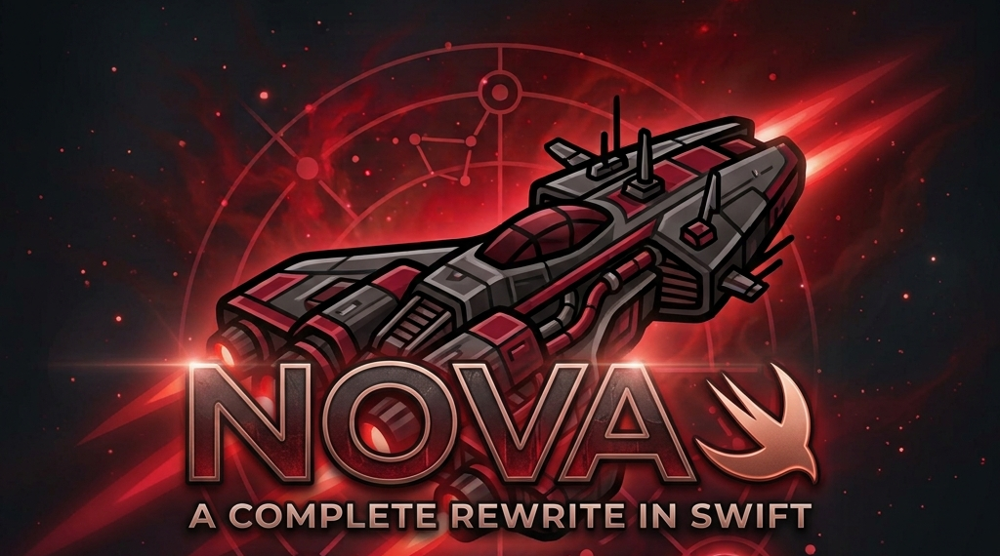
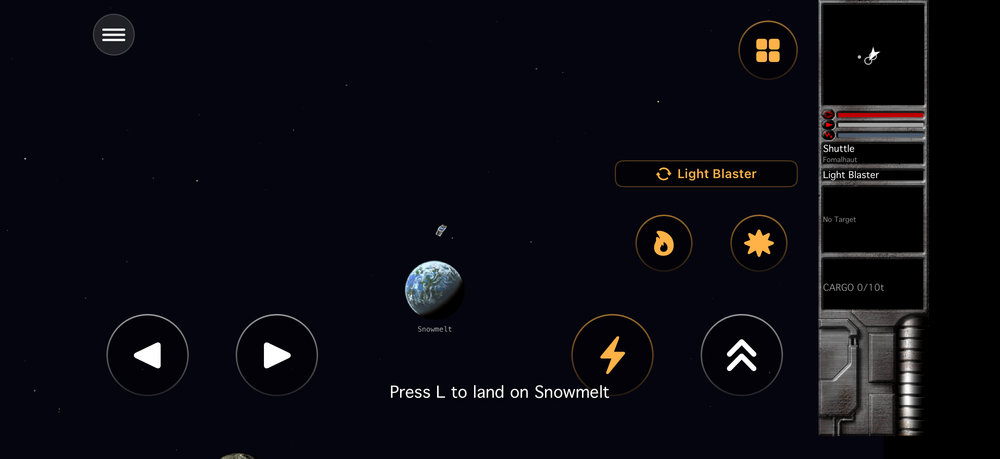
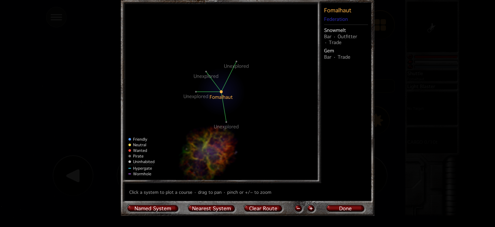
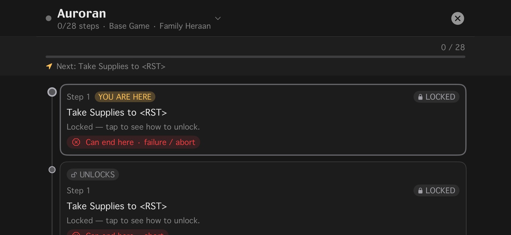
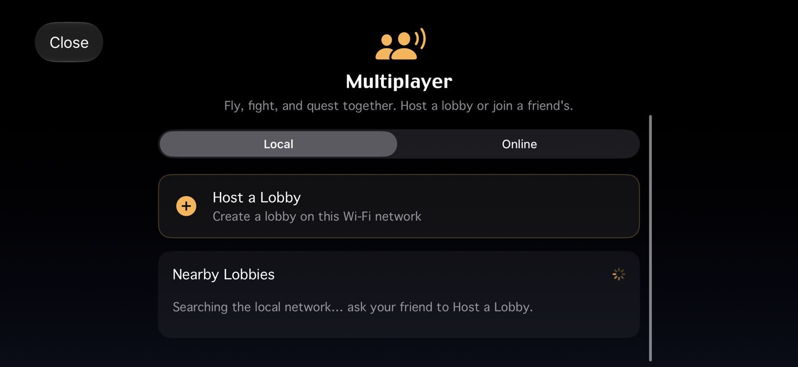
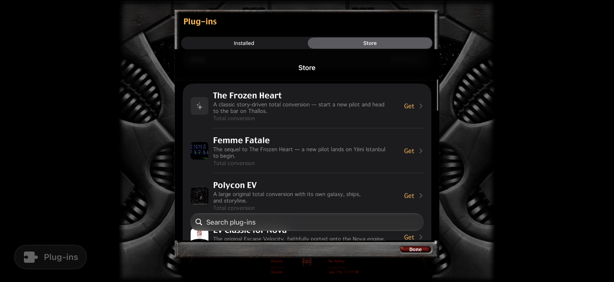

# NOVA Swift



**A fan rebuild of EV Nova, the 2002 space classic — written from scratch in
Swift so it runs natively on your Mac, iPad, iPhone, and Apple TV.** Unofficial,
unaffiliated, and bring-your-own-data. See [Legal](#legal).

---

EV Nova (Ambrosia Software / ATMOS, 2002) is one of the deepest space
trading-and-combat games ever made — and it's PowerPC/Carbon code. It won't
launch on a modern Mac, it never came to phones or tablets, and the one serious
open-source revival went quiet in 2023.

NOVA Swift rebuilds it from scratch in Swift: resource parser, flight, combat,
AI, missions, economy, and UI. Not a wrapper, not an emulator. Point it at a copy
of EV Nova you already own and it plays your data natively, with touch controls
built for a screen you hold.

Runs today on **macOS, iPadOS, iOS, and tvOS**, all tested on real devices. A
**Godot port for Linux and Windows** is [in progress](#linux-and-windows-the-godot-port).

## Screenshots

Running on iPhone:

| Flight | Galaxy map |
|---|---|
|  |  |
| Touch controls and the classic status bar. | Services, governments, hypergates and wormholes. |

| Story map | Multiplayer |
|---|---|
|  |  |
| Every campaign in your data, drawn against your pilot's progress. | Co-op lobbies over local Wi-Fi or Game Center. |

| Plug-in store |
|---|
|  |
| Community plug-ins and total conversions, installed in-game. |

## What you can do

It's 1177. The Federation is rotting from the inside, the Auroran Empire is
tearing itself apart over honor, the Polaris won't say what they know, and you're
in a Shuttle with a few thousand credits and no particular plans.

- **Fly and fight** — the momentum-heavy flight the original was built on: you
  don't turn, you swing the nose around and keep going the way you were. Lock a
  target, strip its shields, watch the ion cannons leave it drifting.
- **Explore and trade** — hyperjump between hundreds of systems on real fuel and
  work the spread, then trade the Shuttle up through a Starbridge to something
  with real guns on it.
- **Play the story** — pick a scenario and take the missions people offer you.
  Fly for the Federation or defect to the Rebellion, get pulled into the Auroran
  succession, find out what the Vell-os are. Campaigns branch; the news reacts.
- **Fight dirty, and lose for real** — board a disabled freighter for its cargo
  or fly the hull home with a prize crew. Demand tribute from a planet and it
  pays you daily. Shoot the wrong ship and the government remembers.
- **Meet the locals** — named captains with their own lines turn up in the
  shipping lanes, hired escorts draw a wage whether they're useful or not, and
  there's always the holovid races to throw credits at.
- **Play together** — the one thing the 2002 original never had. Your friend
  keeps their own galaxy and pilot, but in a shared system you fly it together:
  same NPCs, same fight, real damage. PvP stakes are yours to set.
  ([docs/MULTIPLAYER.md](docs/MULTIPLAYER.md))

## Modern touches, classic at heart

**Anything that wasn't in the 2002 original can be switched off.**

- **Touch controls** built for a handheld screen, not a desktop UI on glass.
- **Full controller support** — twin-stick flight, every button remappable, on
  all four platforms. ([docs/CONTROLS.md](docs/CONTROLS.md))
- **A live story map** of every campaign in your data.
- **An in-app plug-in store** for community plug-ins and total conversions.
- **iCloud data sync** — import once, and your other devices restore it
  automatically. ([docs/ICLOUD_SYNC.md](docs/ICLOUD_SYNC.md))
- **Apple TV** with a 10-foot UI, controller required. ([docs/TVOS.md](docs/TVOS.md))
- **Classic / Enhanced toggles** to opt into the modern layer piece by piece.
- **A built-in debug suite** — AI visualization, live state editor, stress test.

## Where it's at

**You can play the whole game today, start to finish, on all four platforms.**
Flight and combat, the economy, branching campaigns, boarding and capture,
planetary domination, named captains, hired escorts, explosions and particles —
the systems that make EV Nova *EV Nova* are in and playable. Call it ~90% of a
full port.

What's left:

- **Fidelity** — AI, flight feel, spawn cadence, and the hundred small behaviors
  that separate "complete" from "hard to tell apart from the original."
- **Hardening** — bugs, crashes, and performance as more people play on more
  devices.
- **Multiplayer polish** — wider multi-device testing, finer PvP toggles, and
  smoother authority handoff when a host drops mid-session.
- **Smarter opt-in AI** — better evasion, coordinated fleets, ammo discipline,
  behind the same brain the base AI uses.
- **Optional HD art and audio** — layered over the originals, never replacing them.

Found something off? The
[issue tracker](https://github.com/SirStig/MacOS-iOS-iPadOS-EV-Nova/issues) is
the best place to say so. Plans live in
[docs/ROADMAP.md](docs/ROADMAP.md) and [docs/MODERNIZATION.md](docs/MODERNIZATION.md).

## Linux and Windows: the Godot port

The simulation, data layer, and story runtime are portable Swift with almost no
Apple coupling — only the UI and rendering are SwiftUI/SpriteKit. So a second
frontend on **Godot 4**, bridged through
[SwiftGodot](https://github.com/migueldeicaza/SwiftGodot), reaches Linux and
Windows without forking any game logic: both builds run the same `World.step`.

In progress. The Godot project flies a ship on the engine's real flight model
at the same fixed 30 Hz tick the Apple build uses, and renders ships, planets,
shots, beams, asteroids and explosions decoded from your data — plus a working
HUD, radar, target lock, landing/launch and a first spaceport screen (the
commodity exchange). Sound, the galaxy map, the rest of the spaceport, and the
story runtime are next. Status in
[docs/GODOT_LAYER.md](docs/GODOT_LAYER.md).

## Beta

Builds for all four platforms are live on TestFlight — one link, no build step:

**→ [testflight.apple.com/join/3FBzwwq1](https://testflight.apple.com/join/3FBzwwq1)**

You supply your own EV Nova data.

## The one rule: you bring the game

We ship the code; you supply the data. EV Nova's content is owned by ATMOS, so
**this repo contains zero copyrighted game data and never will.** `NovaSwiftKit`
reads your own legally-owned copy at runtime — classic resource forks, `.ndat`,
or the modern `BRGR .rez` container — the same model as OpenMW and OpenRA. The
reasoning is in [docs/CHARTER.md](docs/CHARTER.md), which governs every decision
in the repo.

## Built with AI

NOVA Swift is developed with heavy AI assistance — most of the engine, the UI,
and the reverse-engineering of EV Nova's resource formats were built
collaboratively with Claude Code. Every change is still checked against the real
game's behavior.

Fittingly, AI is also a subject *inside* the game: NPCs run on a behavior engine
reconstructed from EV Nova's own `düde`/`flët` decision tables, not hardcoded
scripts. See [docs/AI.md](docs/AI.md).

## Build it yourself

> Requires a Mac with Xcode and its command-line tools. Your EV Nova data stays
> on your machine — it's git-ignored and never uploaded.

```bash
# 1 · clone
git clone https://github.com/SirStig/MacOS-iOS-iPadOS-EV-Nova.git
cd MacOS-iOS-iPadOS-EV-Nova

# 2 · fetch open-source dependencies
scripts/setup.sh

# 3 · add your EV Nova data into data/base/  (see docs/GET_THE_DATA.md)

# 4 · (optional) free community plug-ins
scripts/fetch-plugins.sh

# 5 · quick check from the command line
swift build && swift test

# …then open the app in Xcode to play:
open app/NovaSwift.xcodeproj
```

Pick a target and hit Run. Data steps: [docs/GET_THE_DATA.md](docs/GET_THE_DATA.md).

## Repository layout

```
docs/                  Charter, roadmap, architecture, data-format reference
Sources/
  NovaSwiftKit/          Data layer — resource parsing, typed decoders, sprite/PICT decode
  NovaSwiftEngine/       Live sim — flight, combat, AI, spawning, diplomacy
  NovaSwiftStory/        Mission/story runtime — mïsn/crön/NCB engine
  NovaSwiftPluginStore/  Plug-in catalog + download/install pipeline
  novaswift-extract/     CLI inspector/harness that drives the libraries end-to-end
Tests/                 Unit tests per library
app/NovaSwift/         The multiplatform SwiftUI/SpriteKit app (the game itself)
godot/                 Godot 4 frontend + SwiftGodot bridge (Linux/Windows, in progress)
data/base/             ⬅ your legally-owned EV Nova data goes here (git-ignored)
```

## Documentation

Start with the **[Charter](docs/CHARTER.md)** — the authoritative goal. Then
**[Roadmap](docs/ROADMAP.md)**, **[Architecture](docs/ARCHITECTURE.md)**, and
**[Data format](docs/DATA_FORMAT.md)**.

Deep dives: [AI](docs/AI.md) · [ship system](docs/SHIP_SYSTEM.md) ·
[missions & story](docs/MISSIONS.md) · [multiplayer](docs/MULTIPLAYER.md) ·
[mobile & plug-ins](docs/MOBILE_AND_PLUGINS.md) · [controls](docs/CONTROLS.md) ·
[tvOS](docs/TVOS.md) · [iCloud sync](docs/ICLOUD_SYNC.md) ·
[Godot port](docs/GODOT_LAYER.md) ·
[reverse-engineering](docs/reverse-engineering/README.md)

## Legal

EV Nova and its data are **copyrighted**, and this project never redistributes
them — you supply your own legally-obtained copy.

- **Base game data** → you must own EV Nova; the tools only extract from *your*
  copy. It is never bundled here.
- **Community plug-ins** → freely distributed by their authors; the fetch script
  and in-app store pull only free downloads, under their own licenses.
- **This project's code** → open source (see [LICENSE](LICENSE)).

A fan interoperability / preservation effort in the spirit of OpenRA, OpenTTD,
and devilutionX. Unaffiliated with and unendorsed by Ambrosia Software, ATMOS, or
the original authors.
