# NOVA Swift

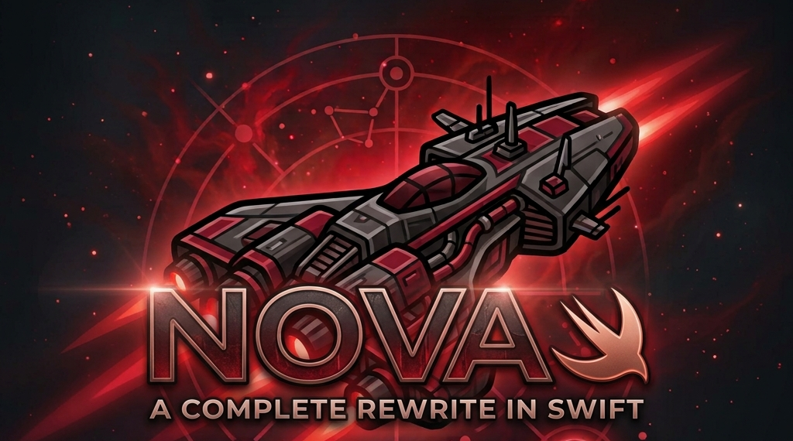

A fan rebuild of EV Nova (Ambrosia Software / ATMOS, 2002), written from scratch
in Swift. It runs natively on macOS, iPadOS, iOS and tvOS. A Godot frontend for
Linux and Windows is in progress. Unofficial and unaffiliated. You need your own
copy of the game; see [Legal](#legal).

The original is PowerPC/Carbon code for the Mac and 32-bit code for Windows. It
doesn't run on a current Mac and never came to phones or tablets. NOVA Swift is a
new engine, not an emulator or a wrapper: it reads your EV Nova data files and
plays them.

## How close to the original

The original Windows executable (EV Nova CE) has been decompiled, and every
gameplay system was re-checked and rewritten against it: flight, hyperjump and
travel days, weapons and damage, the NPC AI state machine, spawning, legal record
per system, the economy, outfitter and shipyard, missions and control-bit
scripting, the star map, targeting, landing, Player Info, saving and Strict Play.
Where a formula was unclear we ran the original routine in an emulator and
matched its output.

Original behaviour is the default. The decompiled code is not in this repo; only
written specs with function addresses are, in
[docs/reverse-engineering/](docs/reverse-engineering/README.md).


Each row is one part of the game. A filled block is roughly 5% of that part's
original code that has been compared with NovaSwift: it matched, it was fixed to
match, or (teal) NovaSwift does that job its own way on purpose, like its save
format and controls.

This measures how much has been checked, not how finished the game is.
NovaSwift is in beta and still has bugs, and play can differ from the original
in ways a code comparison doesn't catch. If something plays differently, please
[report it](https://github.com/SirStig/NovaSwift/issues). For the function-by-function view, see
[docs/STATUS.md](docs/STATUS.md) or the [website](https://sirstig.github.io/NovaSwift/#progress).

### Beyond the original


### Not needed


## Screenshots

| Flight (iPhone) | Galaxy map |
|---|---|
| 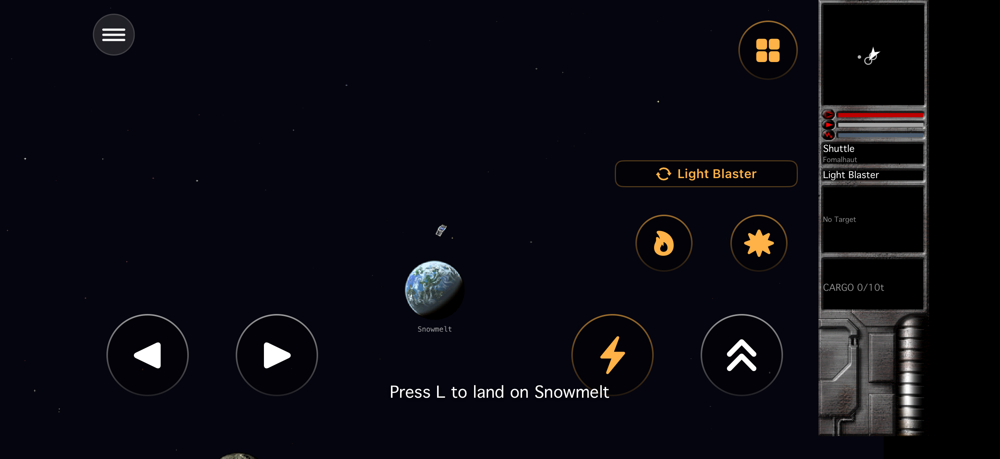 | 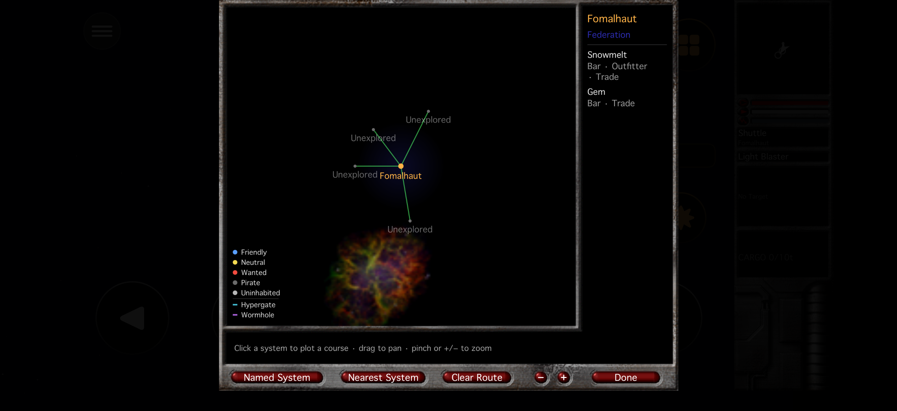 |
| Touch controls and the classic status bar. | Services, governments, hypergates and wormholes. |

| Story map | Multiplayer |
|---|---|
| 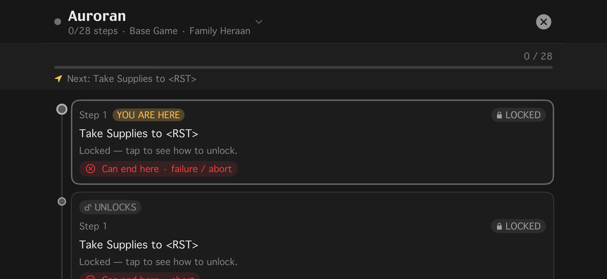 | 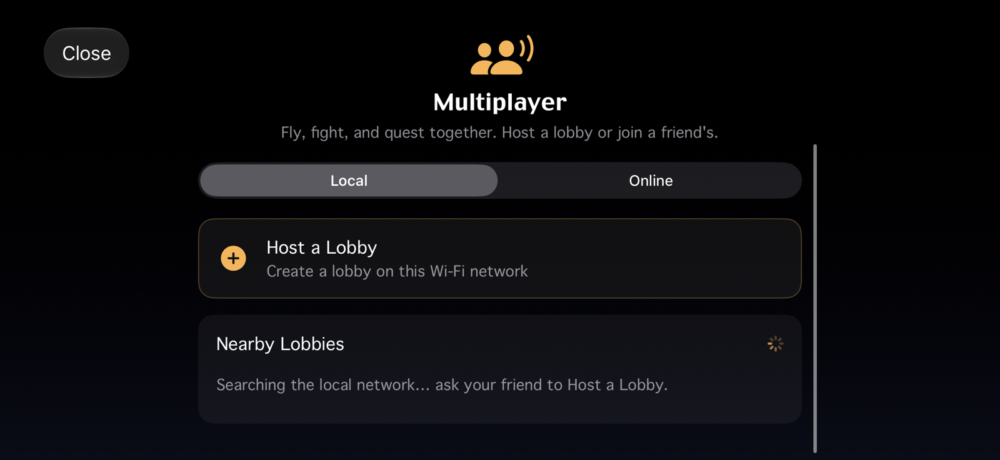 |
| Every campaign in your data, against your pilot's progress. | Co-op lobbies over local Wi-Fi or Game Center. |

| Story Guide | Host lobby |
|---|---|
| 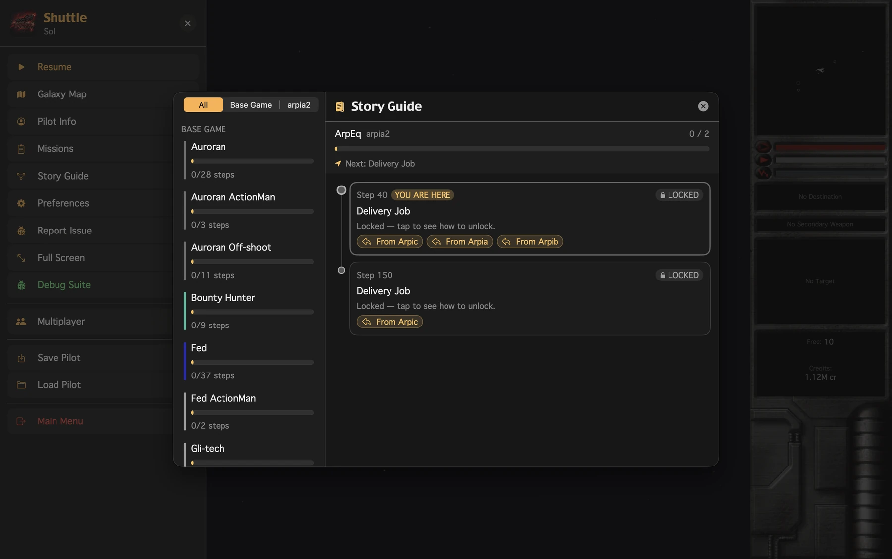 | 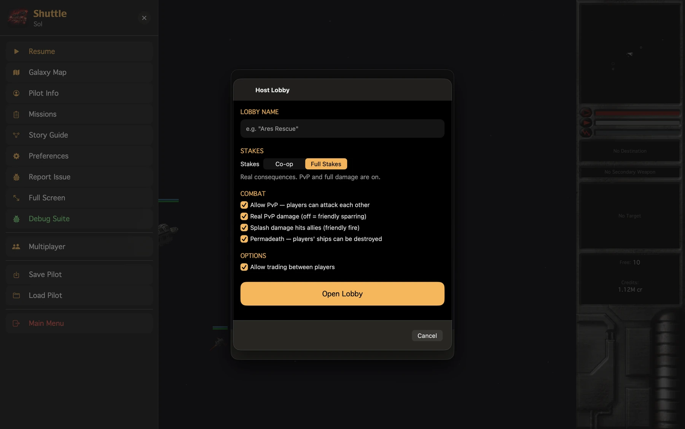 |
| Each campaign as a list of steps, with the mission that unlocks the next one. | Co-op rules: PvP, real damage, friendly fire, permadeath, trading. |

| Presentation presets | Plugins |
|---|---|
| 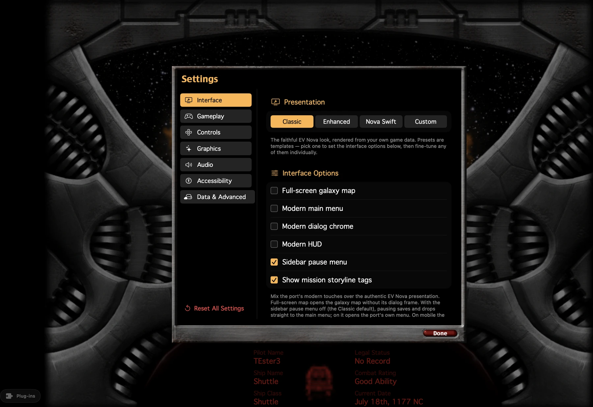 | 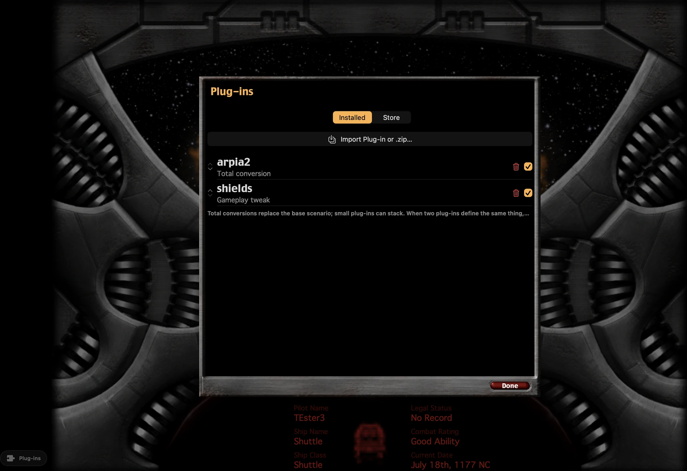 |
| Classic, Enhanced or Nova Swift, then adjust single items. | Install, import, reorder and toggle plug-ins. |

| Plug-in catalog | Debug suite |
|---|---|
| 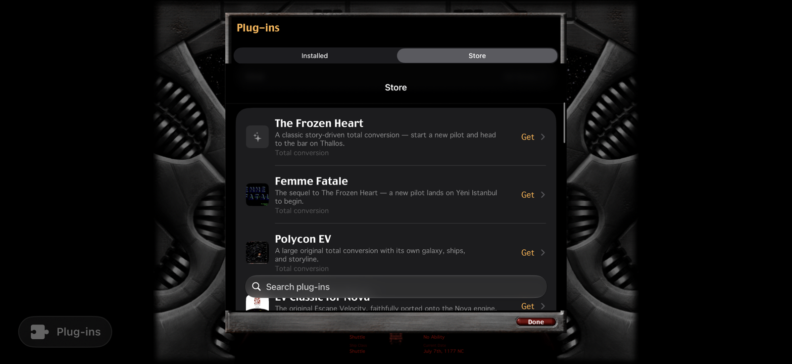 | 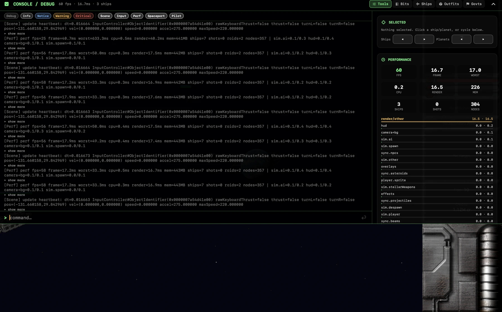 |
| Community plug-ins and total conversions, installed in one tap. | Live logs, frame timing, an inspector and a console. |

## What's in it

The whole game is playable on all four Apple platforms: pick a starting scenario,
fly, fight, trade, outfit, buy ships, take missions, play the storylines through,
board and capture ships, dominate planets, hire escorts, and die with the
original's consequences. Plug-ins and total conversions load the same way they do
in the original.

### Enhancements

A few gameplay changes are available as opt-in Enhancements in
Settings ▸ Enhancements. All are off by default:

- Manual plug-in order
- Frequent autosave
- Quick hyperjump
- Forgiving landing
- Automatic route plotting
- Nearest-first targeting
- Modern key layout
- Tight formations

### Additions that don't change the rules

- Classic, Enhanced and Nova Swift presentation presets, with per-item overrides
- Touch controls, and full controller support on every platform
  ([CONTROLS.md](docs/CONTROLS.md))
- Story Guide and storyline map, tutorial hints, storyline tags
- Plugins: a mod manager that browses the community catalog (one-tap installs, works
  offline for what you already have), imports your own files including old Mac
  `.sit` and `.hqx` archives, and enables, disables, reorders and deletes plug-ins.
  The catalog lives in [NovaSwift-Plugins](https://github.com/SirStig/NovaSwift-Plugins);
  anyone can add a plug-in by pull request.
- Import your old EV Nova pilots: Windows `.plt` files and classic Mac pilots
- Co-op multiplayer over local Wi-Fi or Game Center ([MULTIPLAYER.md](docs/MULTIPLAYER.md))
- iCloud sync of imported game data ([ICLOUD_SYNC.md](docs/ICLOUD_SYNC.md))
- Apple TV with a 10-foot UI ([TVOS.md](docs/TVOS.md))
- HD graphics and 3D models: plug-ins can add high-resolution art or 3D ship and
  planet models, drawn in place of the original sprites with the same hit-boxes
  and gameplay. Off by default ([HD_PIPELINE.md](docs/HD_PIPELINE.md))
- A debug suite: searchable logs you can tap to copy or re-run, profiler,
  inspector, console

## Linux and Windows

The data layer, simulation and story runtime are portable Swift. Only the UI and
rendering use SwiftUI and SpriteKit. A second frontend in Godot 4, bridged with
[SwiftGodot](https://github.com/migueldeicaza/SwiftGodot), runs the same
`World.step` as the Apple build.

So far it flies a ship on the real flight model, renders ships, planets, shots,
beams, asteroids and explosions from your data, and has a HUD, radar, target
lock, landing and launch, and the trade center. Sound, the galaxy map, the rest
of the spaceport, saving and the story runtime are still to do. See
[GODOT_LAYER.md](docs/GODOT_LAYER.md).

## Beta

TestFlight builds for all four Apple platforms:
[testflight.apple.com/join/3FBzwwq1](https://testflight.apple.com/join/3FBzwwq1).
You supply your own EV Nova data.

Bugs go in the [issue tracker](https://github.com/SirStig/NovaSwift/issues).
In the app, Settings ▸ Support ▸ Report a Bug collects a diagnostics bundle.

## Bring your own data

This repo contains no EV Nova game data and never will. The game's content is
owned by ATMOS. `NovaSwiftKit` reads your own copy at runtime, in any of the
formats it shipped in: classic resource forks, `.ndat`, or the `BRGR .rez`
container. OpenMW and OpenRA work the same way. How to add your data:
[GET_THE_DATA.md](docs/GET_THE_DATA.md). The reasoning is in
[CHARTER.md](docs/CHARTER.md).

## Building

You need a Mac with Xcode. Your game data stays on your machine; `data/base/` is
git-ignored.

```bash
git clone https://github.com/SirStig/NovaSwift.git
cd NovaSwift
scripts/setup.sh                # open-source dependencies
# copy your EV Nova data into data/base/ (see docs/GET_THE_DATA.md)
scripts/fetch-plugins.sh        # optional: free community plug-ins
swift build && swift test       # command-line check
open app/NovaSwift.xcodeproj    # then pick a target and Run
```

## Repository layout

```
docs/                    Charter, status, roadmap, architecture, formats, RE specs
Sources/
  NovaSwiftKit/          Resource parsing, typed decoders, sprite/PICT decode
  NovaSwiftEngine/       Simulation: flight, combat, AI, spawning, diplomacy
  NovaSwiftStory/        Missions, crön events, NCB scripting, pilot economy
  NovaSwiftNet/          Multiplayer transports (Game Center, local Wi-Fi), sessions
  NovaSwiftSync/         Multiplayer world-state sync
  NovaSwiftPluginStore/  Plug-in catalog, download and install
  novaswift-extract/     Command-line inspector and test harness
Tests/                   Unit tests per library
app/NovaSwift/           The SwiftUI/SpriteKit app
godot/                   Godot 4 frontend and SwiftGodot bridge
data/base/               Your EV Nova data (git-ignored)
```

## Documentation

[docs/README.md](docs/README.md) is the index. The main ones:
[Charter](docs/CHARTER.md), [Status](docs/STATUS.md),
[Roadmap](docs/ROADMAP.md), [Architecture](docs/ARCHITECTURE.md),
[Data format](docs/DATA_FORMAT.md), and the
[reverse-engineering specs](docs/reverse-engineering/README.md).

## Legal

EV Nova and its data are copyrighted. This project does not redistribute them.

- Base game data: you must own EV Nova. The tools only read your copy.
- Community plug-ins: the catalog links to public downloads. A plug-in is only
  rehosted when its readme allows redistribution, and authors can ask for removal.
- This project's code is open source; see [LICENSE](LICENSE).

The reverse-engineering docs describe behaviour in prose, short formulas and
constants. No decompiled code is included.

This is a fan preservation and interoperability project in the spirit of OpenRA,
OpenTTD and devilutionX. It is not affiliated with or endorsed by Ambrosia
Software, ATMOS or the original authors. AI tools were used in its development.
